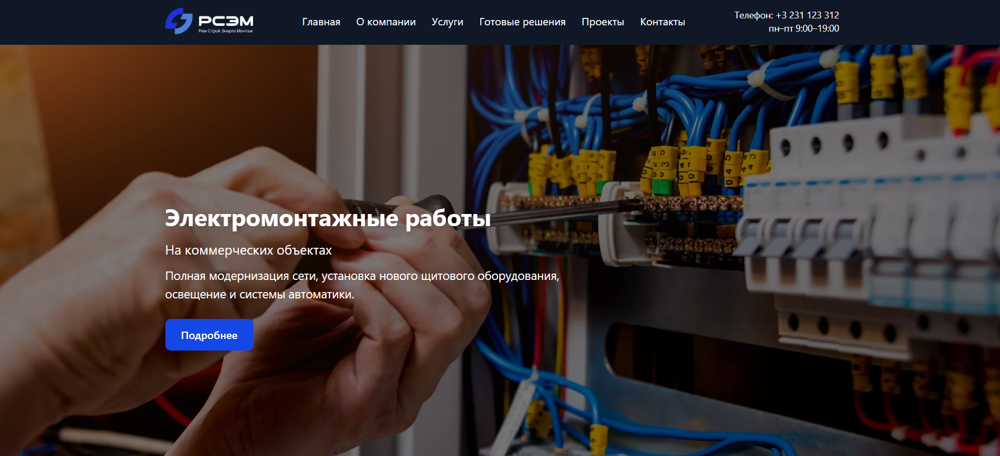
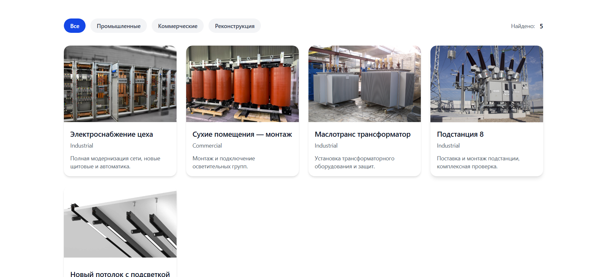

# ⚡ RSEM
## 📸 Screenshots

### Главная страница

### Раздел проектов

**RSEM** is a modern landing website for an electrical engineering company.
It includes several main sections:

* Home
* About
* Services
* Solutions
* Projects
* Contacts

The site is built using **Vite**, **React**, **TypeScript**, and **Tailwind CSS** to ensure high performance, maintainability, and responsive design.

---

## 🚀 Tech Stack

* **Vite** – Fast and modern build tool
* **React 19** – UI library for building components
* **TypeScript** – Static type checking
* **Tailwind CSS** – Utility-first CSS framework
* **React Router DOM** – Page routing
* **React Hook Form** – Form management
* **Lucide React** – Icon library

---

---

## 📄 License

This project is licensed under the **MIT License**.

